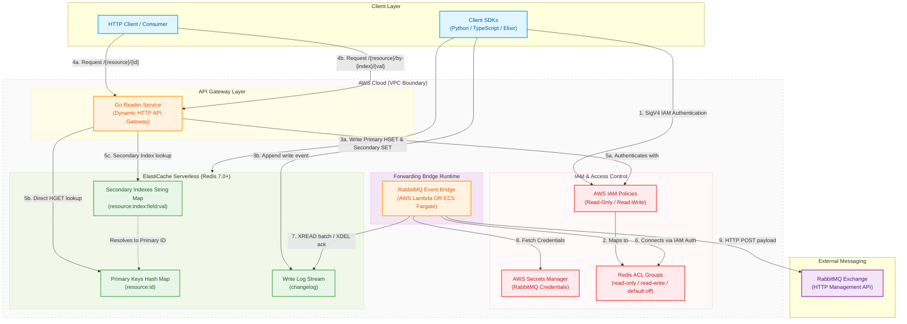

# Architecture Diagram: Shared Key-Value Store & API Gateway

This document provides a visual representation and detailed explanation of the shared high-performance key-value store architecture powered by AWS ElastiCache Serverless (Redis).

## Architecture Diagram

---

## Architectural Breakdown

### 1. Security & Identity Boundary
* **AWS IAM Authentication**: Connection passwords are generated on-the-fly via IAM SigV4 query authentication tokens (expiring after 15 minutes) in both client SDKs and services.
* **Redis ACL Control**:
  * `read-only`: Mapped to reader components; permissions restricted to reading hashes and keys (`+@read`).
  * `read-write`: Mapped to writer components; full operational permissions (`+@all`).
  * `default`: Explicitly disabled (`off`) for security compliance.
* **VPC Isolation**: The cache cluster and dynamic services are placed inside private subnets, with ingress strictly governed by security groups.

### 2. Cache Layout & Indexing Strategy
* **Primary Key Hash Map**: The actual JSON record payloads are stored in Redis Hashes under `{resource}:{id}` keys.
* **Secondary Index Map**: String keys mapped from `{resource}:index:{field}:{value}` containing the primary record identifier as their value. Lookups resolve this key first, then issue an `HGET` on the resolved primary key.
* **TTL Coherency**: Writer client SDKs atomically expire both primary and index keys using identical Time-To-Live parameters to avoid orphaned indexes.

### 3. Reading/Writing Data Flow
1. **Writing**: Client SDKs (available in [Python SDK](file:///Users/lewiscowles/Projects/dynamodb-shared-store/clients/python/store_client.py), [TypeScript SDK](file:///Users/lewiscowles/Projects/dynamodb-shared-store/clients/typescript/store_client.ts), and Elixir SDK) write directly to the primary and secondary cache keys.
2. **Dynamic Reading**: The [Go Reader Service](file:///Users/lewiscowles/Projects/dynamodb-shared-store/services/reader/main.go) serves as a high-performance HTTP gateway to resolve cache entries. It streams raw JSON values directly back to consumers, setting customized MIME content types matching `application/json+vnd+{vendor}/{resource}{version}` automatically.

### 4. Legacy Integration Bridge
* **RabbitMQ Event Bridge**: If configured via [bridge.tf](file:///Users/lewiscowles/Projects/dynamodb-shared-store/bridge.tf), the module deploys a worker (using either AWS Lambda or an ECS Fargate container) that periodically reads records from the `changelog` stream in Redis, checks credential access via Secrets Manager, and forwards those events onto external RabbitMQ broker exchanges before executing an acknowledging deletion (`XDEL`) on the stream.
