# Architecture & API Specification: Shared Key-Value Store & API Gateway

This document provides a detailed visual representation, architectural breakdown, and api routing specification for the shared store system, supporting both AWS ElastiCache Serverless (Redis) and AWS DynamoDB backends.

---

## 1. Architecture Diagram

```mermaid
flowchart TB
    %% Nodes & Styling
    classDef client fill:#e1f5fe,stroke:#03a9f4,stroke-width:2px,color:#01579b;
    classDef gateway fill:#fffde7,stroke:#fff59d,stroke-width:2px,color:#827717;
    classDef aws fill:#fff3e0,stroke:#ff9800,stroke-width:2px,color:#e65100;
    classDef security fill:#ffebee,stroke:#f44336,stroke-width:2px,color:#b71c1c;
    classDef redis fill:#e8f5e9,stroke:#4caf50,stroke-width:2px,color:#1b5e20;
    classDef ddb fill:#ede7f6,stroke:#673ab7,stroke-width:2px,color:#311b92;
    classDef external fill:#f3e5f5,stroke:#9c27b0,stroke-width:2px,color:#4a148c;

    subgraph Client_Space ["Consumer / Client Layer"]
        SDK["Client SDKs<br/>(Python / TypeScript / Elixir)"]:::client
        Consumer["HTTP Client / Consumer"]:::client
    end

    subgraph AWS_Cloud ["AWS Cloud (VPC Boundary)"]
        
        subgraph IAM_Security ["IAM & Access Control"]
            IAM["AWS IAM Policies<br/>(DynamoDB / ElastiCache SigV4)"]:::security
            Secrets["AWS Secrets Manager<br/>(RabbitMQ Credentials)"]:::security
        end
        
        subgraph Gateway_Layer ["Gateway Layer: Go Reader Service"]
            GoReader["Go Reader API Gateway"]:::gateway
            OTel["OpenTelemetry Tracer<br/>(gRPC Spans to Collector)"]:::gateway
            Validator["JSON Schema Validator<br/>(Draft-07 Compilation)"]:::gateway
            ContentNeg["Content Negotiator<br/>(Accept Header Parser)"]:::gateway
        end

        subgraph Redis_Backend ["Backend A: ElastiCache Serverless (Redis)"]
            HashKeys["Primary Hashes<br/>(resource:id)"]:::redis
            IndexKeys["Secondary Indexes<br/>(resource:index:field:val)"]:::redis
            Changelog["Write Log Stream<br/>(changelog)"]:::redis
        end

        subgraph DynamoDB_Backend ["Backend B: AWS DynamoDB Table (Serverless)"]
            DDBTable["Single Table Design<br/>(Partition Key: PK)"]:::ddb
            GSI1["Secondary Index: GSI1<br/>(Partition Key: GSI1PK)"]:::ddb
        end

        subgraph Event_Bridge ["Optional Redis Event Bridge"]
            Bridge["RabbitMQ Forwarder Bridge<br/>(Lambda OR ECS Fargate)"]:::aws
        end
    end

    subgraph Legacy_Broker ["External Messaging"]
        Rabbit["RabbitMQ Exchange<br/>(HTTP Management API)"]:::external
    end

    %% SDK Writes
    SDK -->|"1a. Write (Redis HSET/SET)"| Redis_Backend
    SDK -->|"1b. Write (DynamoDB PutItem)"| DynamoDB_Backend

    %% HTTP GET Reads
    Consumer -->|"2a. GET /{resource}/{id}"| GoReader
    Consumer -->|"2b. GET /{resource}/by-{index}/{value}"| GoReader
    Consumer -->|"2c. GET /openapi.json"| GoReader

    %% Go Reader Operations
    GoReader -->|"3. Trace spans"| OTel
    GoReader -->|"4. Parse Accept & Query params"| ContentNeg
    GoReader -->|"5. Auth via SigV4 / IAM"| IAM

    %% Read Routing - Redis
    GoReader -->|"6a. HGET lookup (Redis)"| HashKeys
    GoReader -->|"6b. GET index (Redis)"| IndexKeys
    IndexKeys -.->|"Resolve Primary ID"| HashKeys

    %% Read Routing - DynamoDB
    GoReader -->|"7a. GetItem lookup (PK = resource:id)"| DDBTable
    GoReader -->|"7b. Query GSI1 (GSI1PK = resource:index:val)"| GSI1
    GSI1 -.->|"Projected Payload"| DDBTable

    %% Validation & Errors
    GoReader -->|"8. Validate payload schema"| Validator
    Validator -->|"Fail: 500 application/problem+json (RFC 9457)"| Consumer
    Validator -->|"Pass: 200 Negotiated Content-Type"| Consumer

    %% Event forwarding
    Bridge -->|9a. XREAD Stream| Changelog
    Bridge -->|9b. Credentials lookup| Secrets
    Bridge -->|9c. Forward POST| Rabbit

    %% Styling Boundaries
    style AWS_Cloud fill:#fafafa,stroke:#ccc,stroke-dasharray: 5 5;
    style IAM_Security fill:#fff9f9,stroke:#ffcdd2;
    style Gateway_Layer fill:#fffde7,stroke:#fff59d;
    style Redis_Backend fill:#f1f8e9,stroke:#d0e7b5;
    style DynamoDB_Backend fill:#f3e5f5,stroke:#d1c4e9;
    style Event_Bridge fill:#fdf5e6,stroke:#ffe0b2;
```



---

## 2. API Routing & Content Negotiation Specification

The Go Reader Service implements dynamic runtime content negotiation and schema enforcement.

### Dynamic Endpoints

#### 1. Primary Lookup
* **HTTP Method**: `GET`
* **Path**: `/{resource}/{id}`
* **Parameters**:
  * `resource`: The resource type directory matching loaded schemas (e.g. `companies`, `users`).
  * `id`: The unique record identifier.
  * `v` (Optional Query Param): Requested version fallback (e.g., `v1`).
* **Headers**:
  * `Accept` (Optional): Negotiates returned version and format representation.
* **Responses**:
  * **`200 OK`**: Returns payload with content-type mapped via negotiation:
    * `application/json+vnd+{vendor}/{resource}{version}`
    * `application/json+vnd.{vendor}.{resource}.{version}`
    * `application/json` (fallback mapping)
  * **`500 Internal Server Error`**: Cache data failed schema validation (RFC 9457 `application/problem+json` format).
  * **`404 Not Found`**: Resource does not exist in cache.

#### 2. Secondary Lookup
* **HTTP Method**: `GET`
* **Path**: `/{resource}/by-{index}/{value}`
* **Parameters**:
  * `resource`: The resource type.
  * `by-{index}`: The index lookup parameter (e.g. `by-account_id` or `by-email`).
  * `value`: The index search value.
* **Responses**: Same as Primary Lookup.

#### 3. OpenAPI Specifications
* **HTTP Method**: `GET`
* **Path**: `/openapi.json`
* **Responses**:
  * **`200 OK`**: OpenAPI 3.0.3 representation containing loaded components, dynamic resource enums, and negotiate Content-Type schema mappings. If local environment is configured with `YOLO_MODE=true`, returns a mock placeholder OpenAPI definition.

---

## 3. Structural Storage Schemes

### Redis Scheme
* **Primary Store**: Stored as a Redis Hash at `{resource}:{id}` where the field `payload` holds the raw JSON payload.
* **Secondary Index Store**: Stored as a Redis String at `{resource}:index:{field}:{value}` containing the primary ID as its value.
* **Changelog Log Stream**: Events are written to the Redis stream `changelog` for external forwarding.

### DynamoDB Scheme
* **Partition Key (`PK`)**: `{resource}:{id}` (e.g., `companies:comp-123`).
* **Secondary Index Partition Key (`GSI1PK`)**: `{resource}:index:{field}:{value}` (e.g., `companies:index:account_id:acc-456`).
* **Payload attribute**: Mapped as a String attribute `payload`.
* **Index Projection**: `GSI1` projects `ALL` attributes, allowing GSI queries to retrieve payloads in a single roundtrip.
* **Expiration**: Automated TTL mapped to `ttl` attribute (Unix epoch in seconds).

---

## 4. Observability & Diagnostics

1. **Structured JSON Logs**: Logs output to stdout via Go's `log/slog` structured JSON format.
2. **OpenTelemetry (OTel)**:
   * Traces incoming request latency, storage lookup latency, and validator processing times.
   * If `OTEL_EXPORTER_OTLP_ENDPOINT` is configured, automatically initializes a gRPC trace batch pipeline. Otherwise, falls back to a silent local no-op trace collection.
   * Internal data errors (like cache schema mismatch validation failures) are reported directly as errors on the active OTel spans using `span.RecordError()`.
3. **RFC 9457 Problem Details**: When schema validation fails, the client receives the error details inside a standard `application/problem+json` payload:
   ```json
   {
     "type": "https://problems.myorg.com/cache-data-invalid",
     "title": "Cache Data Corrupted",
     "status": 500,
     "detail": "The data retrieved from upstream store failed internal schema validation constraints",
     "instance": "/companies/comp-123",
     "errors": [
       "jsonschema: '/name' does not validate: expected string, but got number"
     ]
   }
   ```
