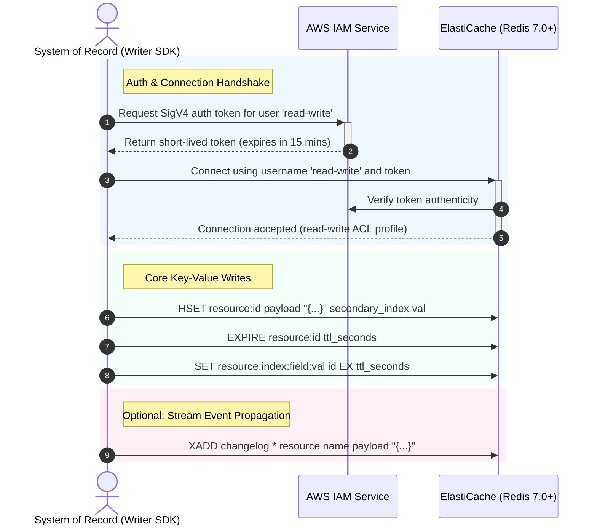
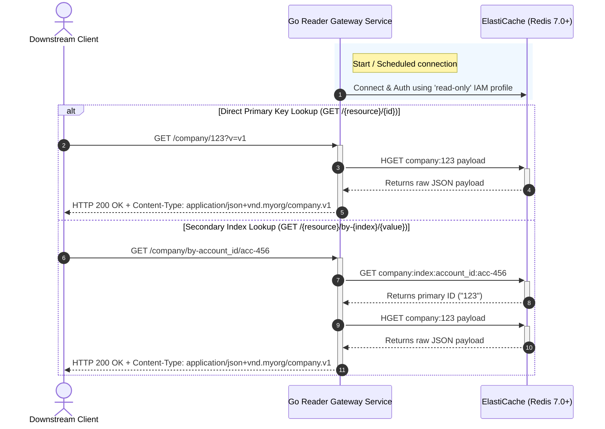

# Operations Guide: Shared Key-Value Store

This guide details how to perform common operations, configure client authentication, and integrate downstream workloads.

---

## 1. System of Record Writing to the Cache

When a System of Record (SoR) or publisher writes to the shared store, it executes three logical operations (and optionally a fourth for event bridge propagation) within a short window (ideally pipeline/transaction) to ensure cache coherency.

### Sequence Diagram: Writing Data



### Writing Rules & Best Practices
* **Namespace Isolation**: Always prefix keys with the system/domain namespace (e.g. `company`).
* **TTL Coherency**: Ensure both the primary Hash key and the secondary index lookup key have the same expiration time.
* **Stream Schema**: Write events to the `changelog` stream using a consistent structured format (e.g., fields: `resource`, `payload`).

---

## 2. Downstream Reading from the Resource

Downstream clients read from the resource using either the high-performance [Go Reader Service](file:///Users/lewiscowles/Projects/dynamodb-shared-store/services/reader/main.go) API gateway, or via direct client lookup.

### Sequence Diagram: Reading Data (API Gateway)



### Gateway Content-Type Resolution
The gateway dynamically crafts headers based on the query parameters:
* Header pattern: `application/json+vnd.+{VENDOR}/{RESOURCE}{VERSION}`
* Default version fallback is `v1` if `?v=` parameter is omitted.

---

## 3. Terraform Configuration: IAM Policy Integrations

Workloads deploying tasks or lambdas that consume or write to the shared store attach the IAM policies produced as module outputs:
* `module.shared_store.read_only_policy_arn`
* `module.shared_store.read_write_policy_arn`

### Example: Attaching Access Roles to a Client Application

Below is a configuration snippet showing how a downstream consumer task on ECS Fargate leverages the read-only policy.

```hcl
# 1. Instantiate the Shared Cache Module
module "shared_store" {
  source      = "git::https://github.com/your-org/dynamodb-shared-store.git//terraform"
  name        = "shared-store"
  environment = "production"
  subnet_ids  = ["subnet-abc12345", "subnet-def67890"]
  vpc_id      = "vpc-1234567890abcdef"
  
  # Allow traffic from client security group
  allowed_security_group_ids = [aws_security_group.my_consumer_app.id]
}

# 2. Define the Downstream Application IAM Execution & Task Roles
resource "aws_iam_role" "my_consumer_task_role" {
  name = "my-consumer-app-task-role"

  assume_role_policy = jsonencode({
    Version = "2012-10-17"
    Statement = [
      {
        Action = "sts:AssumeRole"
        Effect = "Allow"
        Principal = {
          Service = "ecs-tasks.amazonaws.com"
        }
      }
    ]
  })
}

# 3. Attach the Shared Store's Read-Only Policy to the App's Task Role
resource "aws_iam_role_policy_attachment" "attach_read_only_cache" {
  role       = aws_iam_role.my_consumer_task_role.name
  policy_arn = module.shared_store.read_only_policy_arn
}

# 4. Define the Task Definition with Endpoint Injecting Env Vars
resource "aws_ecs_task_definition" "my_consumer_app" {
  family                   = "my-consumer-app"
  network_mode             = "awsvpc"
  requires_compatibilities = ["FARGATE"]
  cpu                      = "256"
  memory                   = "512"
  task_role_arn            = aws_iam_role.my_consumer_task_role.arn

  container_definitions = jsonencode([{
    name      = "app"
    image     = "myorg/my-consumer-app:latest"
    essential = true
    environment = [
      { 
        name  = "REDIS_HOST"
        value = module.shared_store.cache_endpoint_address 
      },
      { 
        name  = "REDIS_PORT"
        value = tostring(module.shared_store.cache_endpoint_port) 
      },
      { 
        name  = "REDIS_USERNAME"
        value = module.shared_store.read_only_user_name 
      }
    ]
  }])
}
```
